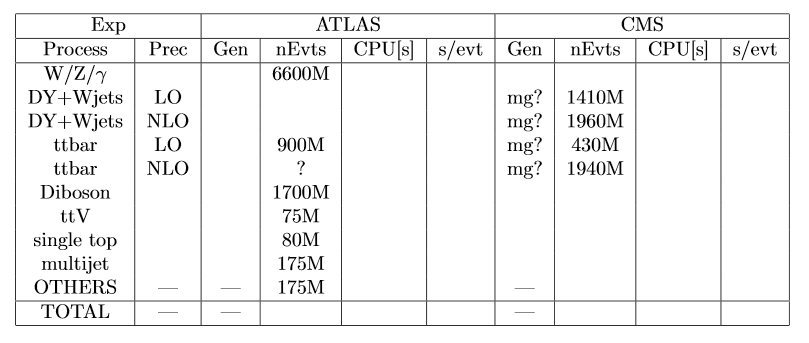

# {{page.title}}

*Agenda:
[https://indico.cern.ch/event/799280/](https://indico.cern.ch/event/799280/)*

*Present/Contributors: Simone Amoroso, Andrea Valassi, Efe Yazgan, Frank
Siegert, Graeme Stewart, Josh Bendavid, Josh McFayden, Qiang, Tommaso
Boccali, Stephen Jiggins, Steve Mrenna, Walter Hopkins, Liz
Sexton-Kennedy, Andy Buckley, Stefan Roiser*

## News, general matters
  - Main priorities: follow up on items identified at November
    workshop, for which we are writing proceedings. Still more items
    to discuss over the longer term.
  - Is this an acceptable slot for regular meetings?
      - Graeme: conflict with ATLAS software coordination, pretty much
        every week.

## CMS event generator accounting update
  - JoshMF: some relatively large disparity between ATLAS and CMS
    numbers. We are looking into this and this presentation is about
    it.
  - Qiang’s presentation
      - Slide2 from Eze’s talk at the workshop: 15B events in 8 months
        of 2017, around 85s/evt for the whole chain
      - Slide 3: fall17 is for one data taking year
      - Slide 4: 5% is for LO and 17% for NLO (matching samples),
        while pure LO (non matching) is much lower (Susy and exotica)
  - JoshB: madgraph in gridpack mode does not support MT at all, it is
    running on one core alone
      - In madgraph NLO there is some MT support
      - JoshMF: inefficiency is because GEN run at same place as SIM
      - JoshMF: is pythia MT? Liz: yes it is. Steve: have had a lot of
        feedback and testing and no MT issue has been found so far
        (except for initial issues that have been fixed by now).
      - FrankS: so in pythia you do not need to add mutexes around the
        code? Liz: we actually have multiple instances of pythia in
        separate threads. JoshB: not sure, we are wrapping with it
        things like tauola and are effectively using only one thread.
        Liz: the framework protects around Fortran common blocks.
        FrankS: in ATLAS we are not using MT yet, not even in
        simulation, so we need to worry about it for generation too.
        We are running generation in single mode at the moment.
      - Steve: for pythia we are running everything in single
        instance, we do not see reasons to reengineer. FrankS: good
        point, why do we need to do this in MT at all, is it just
        saving memory? This may be more complex for some ME
        generators.
      - JoshB: even if you run multiple instances of pythia in one CMS
        main, the advantage is that you have all events in a single
        output thread to write together.
  - Andrea: is 1% on slide 2 from accounting? How to reconcile with
    5-17 from slide 4? Liz: difficult to extrapolate from single node
    tests of Qiang to Grid.
      - JoshMF: also ATLAS is from Grid, but we need precise numbers
        for CMS too.
      - Andrea: in CMS do you record separately SIM and GEN for Grid
        jobs or not? Liz: yes we record them, but they are in a spark
        cluster type of bookkeeping. It is difficult to extract the
        numbers. Andrea: could you improve the computing
        infrastructure to make the info more accessible? Liz: good
        question, will raise it in CMS.
      - Andrea: in ATLAS is it more easily accessible? JoshMF: yes the
        numbers we quoted are definitely from production and we took
        the time to do the calculation (which was complex).
      - JoshB: some of this is POWHEG, which may even make accounting
        more confusing.
      - JoshMF: is it conceivable to get an expert to analyse these
        databases? Liz: can dig out some details. Andrea: if the issue
        is finding an expert, I can ask an IT colleague who is
        analysing other CMS logs.
  - JoshMF: is Drell Yan the most CPU-consuming process?
  - JoshMF: can we have an update on this in 2 weeks or maybe 4 weeks?
      - Qiang: please circulate minutes and action list so we can
        decide
      - Liz: in 4 weeks there will be the workshop, this may not be
        the best moment. JoshMF: we also definitely plan a meeting in
        2 weeks on sharing samples, we could add this there.

Action items:
  - Get the total absolute amount of CPU seconds for the GEN step and
    for the full chain for this 2017 campaign.
  - Fill in (at a minimum) the nEvts column in Table 2 in proceedings:
    ([https://www.overleaf.com/1326158343ftxgrxxcspxg](https://www.overleaf.com/1326158343ftxgrxxcspxg))

> 
  - Get precise GEN no. of events and CPU s/evt for sets of sample
    that are roughly the same between ATLAS and CMS:
      - W+jets LO Ht-sliced
      - W+jets NLO (N-Jets)
      - ttbar Powheg+Pythia8 inclusive NLO

## Discussion on sharing samples across experiments
  - This is postponed to the next meeting on March 14.
  - JoshMF: ATLAS SUSY convenor (Zach Marshall) confirmed he can
    attend the meeting in two weeks and give a report, even if they
    are still in early stages of planning.

## AOB
  - Andrea: will someone be at the JLAB workshop and do people wish to
    have a session there?
      - Graeme: there is a possibility to hold a session on Thu
        afternoon, if interested let me know.
      - Graeme: we also do have a talk on Madgraph/GPU confirmed, it
        would be useful to look at the slides even if you do not
        attend the workshop.
